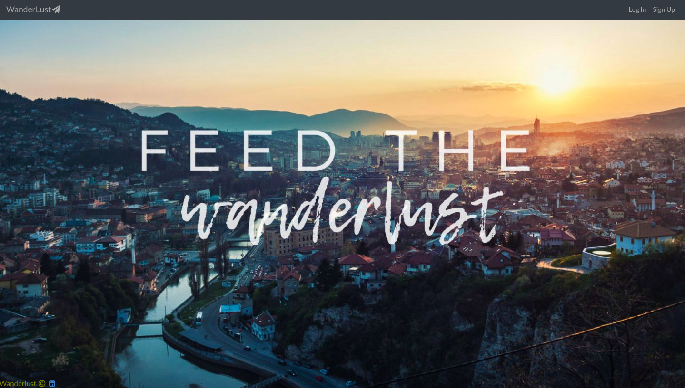

# WanderLust - A place for travel bugs

## Author

* **Andy Reyes** - [AndyRey7](https://github.com/AndyRey7)

 A website where the user can select from a list of hotels available and choose what kind of room to book from that hotel. Then they can view their profile to edit or delete their reservations. Also, they can look for places to eat around where they are staying. All of these feature are provided only if a user is logged in or they can sign-up. Enjoy!

## Setup

To get you going, I've got a backend with hotels waiting to be booked!  To get get these guys, you're going to have to do the follow:

1. In your terminal run `npm install` or `yarn install` to install dependencies.
2. Navigate to `backend-mod-5-proj` and run `rails s` from your terminal to get the backend up and running.
3. Navigate to `wander-lust` and run `npm start` or `yarn start` to get the front-end working

## Features

* User can sign-up or login and view their profile page
* User can view a list of Hotels and types of rooms in that hotel
* User can make a reservation to a room from a hotel
* User can remove a reservation from their profile page
* User can delete their account

## Screenshot

## Made Using:

* React
* Ruby on Rails API
* Google Maps API
* Styling with ReactStrap, Semantic UI React, CSS
